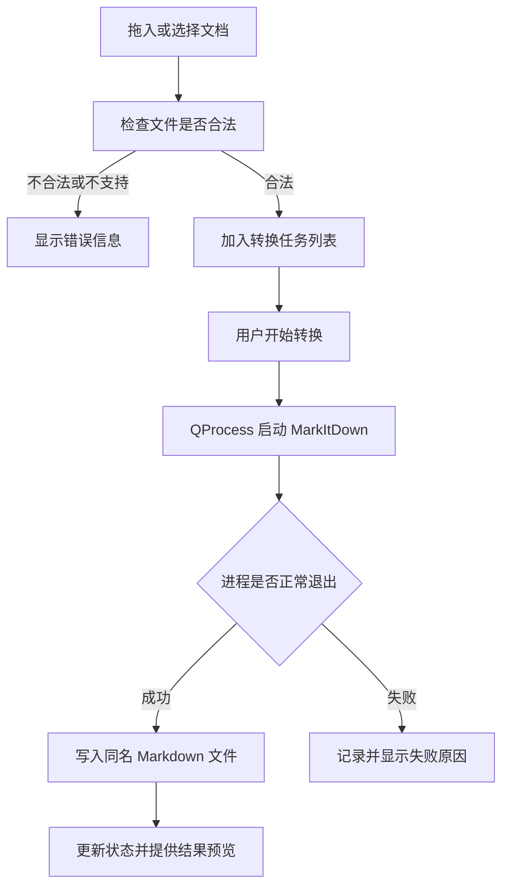

# 文档转 Markdown 图形化工具设计

## 1. 项目目标

`doc2md` 基于 C++ 和 Qt Widgets 构建桌面图形化工具，顶层界面使用 `QWidget`。用户可以通过拖放或文件选择的方式添加文档，Qt 程序通过独立 Python 进程调用 MarkItDown，将文档转换为 Markdown 文件。

第一版重点实现简单、稳定的本地文档转换，不修改 MarkItDown 源码，也不引入需求之外的在线服务。

## 2. 技术选型

- 应用开发语言：C++17。
- GUI 框架：Qt 6.5 Widgets、Pdf、PdfWidgets 和 Svg，主界面基于 `QWidget`。
- 构建工具：CMake。
- 编译工具链：`D:\tools\VS` 中的 MSVC x64。
- 转换引擎：项目 `3rdparty/markitdown/` 目录，Python 包源码位于 `3rdparty/markitdown/src/markitdown/`。
- Python 运行环境：Python 3.10 及以上版本，用于运行 MarkItDown。
- 调用方式：使用 Qt 的 `QProcess` 异步启动 MarkItDown 命令行程序。
- 可选发布方式：将 Qt 运行库、Python 环境、MarkItDown 及其格式依赖随应用一起发布。

MarkItDown 当前支持 PDF、Word、PowerPoint、Excel、HTML、CSV、JSON、XML、EPUB、ZIP 等格式。不同格式依赖不同的可选 Python 包，部署时应根据实际支持范围安装对应依赖。C++ 程序不重新实现文档解析，只负责调用、调度和展示转换结果。

## 3. 总体架构

程序分为 Qt/C++ 应用层和 Python 转换引擎层：

```text
Qt/C++ 图形界面
    ↓
任务管理与输出路径管理
    ↓
QProcess 进程调用
    ↓
Python 3.10+ / MarkItDown 0.1.5
    ↓
Markdown 文件
```

选择进程调用而不是在 C++ 中嵌入 Python，主要原因如下：

- Qt 主程序不需要直接处理 Python C API、解释器初始化和 GIL。
- MarkItDown 及其 Python 依赖与 C++ 界面相互隔离。
- 单个转换进程异常不会直接导致主界面崩溃。
- 后续升级 MarkItDown 时，Qt 界面和任务模型通常不需要调整。

## 4. 界面设计

主界面使用 `QWidget` 作为根窗口，并采用以下布局：

1. 顶部状态区：显示应用标题、Python/MarkItDown 状态和设置入口。
2. 中部工作区：包含文件拖放、输出目录和转换任务列表。
3. 任务右键菜单：源文件和已生成的输出文件支持内部预览、默认应用打开和选择应用打开，输出文件还支持重命名。
4. 独立预览窗口：使用顶层 `QWidget` 展示文本、HTML、图片和 PDF；其他文档通过独立的 MarkItDown 进程生成临时内容。
5. 底部批次区：显示批次摘要、总体进度和开始转换按钮。

任务加入列表时默认使用源文件主名称生成 `.md` 文件名。转换前可通过“输出文件”列的右键菜单为每个任务单独命名；程序会自动补充 `.md` 后缀，并在启动转换前检查非法字符、保留名称、已有文件和任务间重名。单个任务可通过右键菜单或“移除选中”按钮从列表移除，磁盘文件不会被删除。

界面使用集中式 QSS 和资源文件，任务取消、历史记录等功能在后续需求明确后再增加。

## 5. 模块划分

| 模块 | 职责 |
| --- | --- |
| 主窗口 | 组织页面布局，响应用户操作 |
| 拖放组件 | 接收和校验拖入的本地文件 |
| 任务列表 | 保存并展示待转换文件及其状态 |
| 任务管理 | 保存任务状态，控制任务排队和并发数量 |
| 转换服务 | 生成 MarkItDown 命令参数并管理 `QProcess` |
| 运行环境检查 | 检查 Python、MarkItDown 和格式依赖是否可用 |
| 输出管理 | 生成、校验和管理 Markdown 输出路径 |
| 结果预览 | 展示源文件或转换结果，不影响正式转换队列 |

GUI 不直接依赖 MarkItDown 的内部转换器。所有转换统一经过转换服务层，便于以后升级 MarkItDown 或增加自定义转换器。

## 6. 核心流程



## 7. MarkItDown 调用方式

转换服务层使用 MarkItDown 0.1.5 已有的命令行接口：

```text
python -m markitdown -o <输出文件.md> <输入文件>
```

Qt 应通过 `QProcess::setProgram()` 和 `QProcess::setArguments()` 分别传入程序与参数，不拼接 shell 命令，也不使用命令行重定向。这样可以正确处理包含空格、中文和特殊字符的文件路径，并减少命令注入风险。

转换服务通过以下信息判断执行结果：

- `started`：转换进程成功启动。
- `readyReadStandardError`：读取 MarkItDown 的错误输出并记录日志。
- `errorOccurred`：处理 Python 不存在、进程无法启动等错误。
- `finished`：根据退出状态、退出码和输出文件判断转换是否成功。

第一版直接使用 MarkItDown 命令行即可。只有当后续需要更细粒度的内部进度或复杂参数时，再考虑增加一个轻量 Python 适配脚本。

## 8. 后台任务设计

`QProcess` 采用异步信号机制，可以在不阻塞 Qt 主线程的情况下执行转换。建议采用以下方式：

- 主线程只负责界面显示和用户操作。
- 每个正在执行的任务对应一个独立 `QProcess`。
- 任务管理模块监听进程的启动、输出、错误和结束信号。
- 进程结束后更新任务状态，并启动队列中的下一个任务。
- 第一版不额外创建 `QThread`；读取转换结果、预览大文件等操作确有阻塞时再单独评估。

第一版可以限制并发数量，避免同时转换多个大型 PDF 或 Office 文档时占用过多内存。

## 9. 输出规则

- 默认输出文件名为“原文件名.md”。
- 默认输出到用户选择的目录；具体是否默认使用源文件目录需要在编码前确认。
- 输出文件已存在时，不应静默覆盖。具体采用询问、跳过还是自动重命名，需要在编码前确认。
- 单个任务失败不影响任务列表中的其他文件继续转换。
- 写文件失败时保留转换任务和错误原因，方便用户重新处理。

## 10. 异常处理

界面至少需要处理以下情况：

- 拖入目录、快捷方式或不存在的文件。
- Python 解释器不存在或版本不符合要求。
- MarkItDown 未安装或无法导入。
- 文件格式不受支持。
- 对应格式的 MarkItDown 可选依赖未安装。
- 文件损坏、加密或没有读取权限。
- 输出目录不存在或没有写入权限。
- 输出文件重名。
- 转换过程中出现第三方库异常。
- 转换进程崩溃、超时或被用户终止。

错误信息应显示在对应任务上，不因一个文件失败而中断整个批量任务。

## 11. 测试思路

### 11.1 功能测试

- 通过拖放和文件选择分别添加文件。
- 转换单个文件和多个文件。
- 验证生成的 Markdown 文件名称、路径和内容。
- 验证任务状态和结果预览。

### 11.2 边界与异常测试

- 空任务列表、零字节文件和超大文件。
- 重复添加同一个文件。
- 不支持的扩展名和伪造扩展名。
- 损坏、加密或无权限读取的文档。
- 不可写输出目录和已存在的同名 Markdown 文件。
- Python 或 MarkItDown 不存在时的启动提示。
- 文件路径包含空格、中文和特殊字符。
- 转换进程异常退出或长时间无响应。

### 11.3 集成与回归测试

- 分别验证 PDF、DOCX、PPTX、XLSX 等计划支持的主要格式。
- 连续执行多批转换，检查进程、任务和界面状态是否正确释放。
- 检查单个任务失败后其他任务是否仍能正常完成。
- 升级 MarkItDown 或发布程序后重新验证主要格式。
- 在未安装全局 Python 的干净 Windows 环境中验证随程序发布的运行环境。

## 12. 发布方案

开发阶段可以配置本地 Python 虚拟环境路径，例如使用虚拟环境中的 `python.exe` 调用 MarkItDown。正式发布时有两种方式：

1. 将受控的 Python 运行环境、MarkItDown 和依赖随应用一起发布，用户开箱即用。
2. 只发布 Qt/C++ 程序，要求用户自行安装并配置 Python 和 MarkItDown。

为了降低用户使用门槛，建议采用第一种方式。程序启动时应先执行运行环境检查，发现组件缺失时给出明确提示。

Python 设置支持内置、自动检测和自定义路径三种模式。发布包通过 `DOC2MD_BUNDLE_PYTHON` 和 `DOC2MD_PYTHON_RUNTIME_DIR` 指定已经准备好依赖的 Python 运行环境。

## 13. 配置持久化与数据存储

用户配置通过 `QSettings` 持久化，包含 Python 模式与路径、最近输出目录、窗口位置和分栏状态。当前任务仅在内存中维护，不引入数据库。

只有在增加大量转换历史、崩溃恢复、搜索统计或多用户数据后，再评估引入 SQLite。

## 14. 已确认技术项

当前已经确认：

1. C++17、Qt 6.5 和 CMake 3.16 以上。
2. 主窗口使用 `QWidget`，设置窗口使用 `QDialog`。
3. 同名输出文件自动追加数字后缀，不覆盖已有文件。
4. 提供 Markdown 渲染预览和源码预览。
5. 使用 `QSettings`，当前不使用数据库。
6. 发布时支持携带内置 Python，同时允许用户指定其他 Python。
